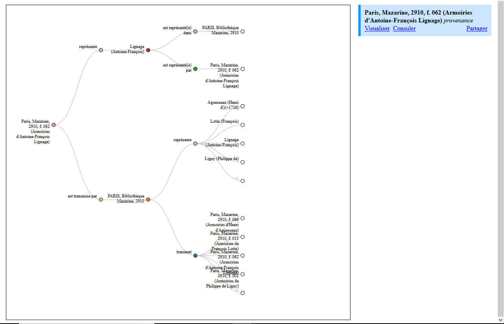
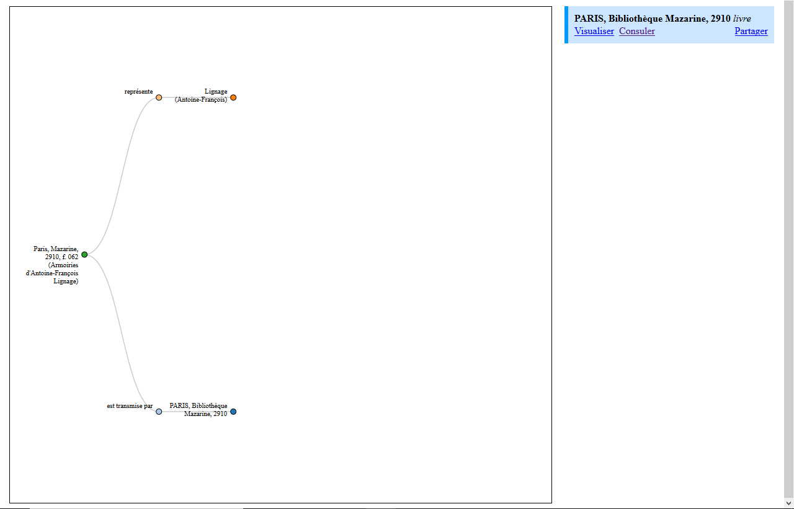

# Data visualization tool

## How to use

The simulation scripts (under assets/js/simulate.js) requires d3.json and a bit of jQuery.

Batteries are already included, all you need to tweak when changing data are the data info function and the loading function (in assets/js/bibale.js)

## Images

